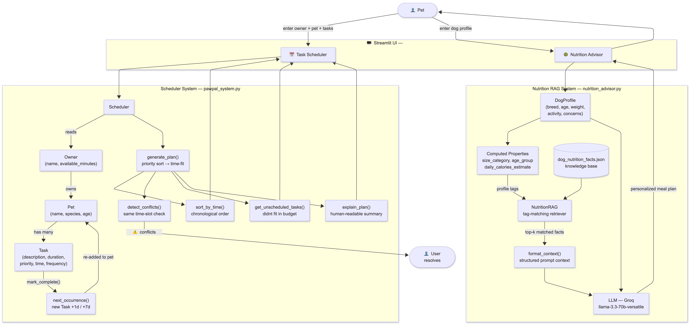

# PawPal+ Applied AI System

**PawPal+** is a Streamlit web app for busy pet owners. It combines a smart daily care scheduler with an AI-powered personalized nutrition advisor — all in one clean two-tab interface.

---

## Demo

[](https://www.loom.com/share/c3bf7cc39fb44542ad22e5232b6651d3)

---

## Original Project

**Original project:** PawPal+ (Module 2 — Smart Pet Task Scheduler)

The original PawPal+ was a rule-based Streamlit app that helped pet owners organize their daily care routines. It let users register owners and pets, add care tasks with priorities and durations, and generate a time-constrained daily plan sorted by priority. It could detect time conflicts, auto-reschedule recurring tasks on completion, and explain its plan in plain language. This applied-AI version extends that foundation by adding a second tab — an AI-powered dog nutrition advisor — that uses Retrieval-Augmented Generation (RAG) to give each dog a personalized meal plan based on breed, age, weight, activity level, and dietary concerns.

---

## Title and Summary

**PawPal+: Smart Pet Scheduler + AI Nutrition Advisor**

Millions of pet owners struggle to stay consistent with care routines and have no quick way to get breed-appropriate nutrition guidance. PawPal+ solves both problems in one app: a deterministic scheduler that fits care tasks into your day, and a RAG-powered AI advisor that generates a personalized meal plan for your dog in seconds. The result is a practical demonstration of how classical object-oriented system design and modern LLM-based AI can work together in a single cohesive product.

---

## Architecture Overview

```
┌─────────────────────────────────────────────────────────────────┐
│                        Streamlit UI (app.py)                    │
│                                                                 │
│   Tab 1: Task Scheduler          Tab 2: Nutrition Advisor       │
│   ─────────────────────          ──────────────────────────     │
│   Owner / Pet / Task forms       Dog profile form               │
│   Generate Schedule button       Get Meal Plan button           │
│   Conflict / unscheduled view    Retrieved facts expander       │
│                                  AI-generated meal plan         │
└──────────────┬──────────────────────────────┬───────────────────┘
               │                              │
               ▼                              ▼
  ┌────────────────────────┐    ┌─────────────────────────────────┐
  │   pawpal_system.py     │    │       nutrition_advisor.py      │
  │  ─────────────────     │    │  ──────────────────────────     │
  │  Task  (data + logic)  │    │  DogProfile  (computed props)   │
  │  Pet   (task list)     │    │  NutritionRAG (tag retrieval)   │
  │  Owner (multi-pet)     │    │  MealAdvisor (LLM call)         │
  │  Scheduler (plan/sort/ │    └────────────┬────────────────────┘
  │   conflicts/recur.)    │                 │
  └────────────────────────┘    ┌────────────▼────────────────────┐
                                │  dog_nutrition_facts.json        │
                                │  (curated RAG knowledge base)    │
                                └─────────────────────────────────┘
                                             │
                                             ▼
                                   Groq API (LLaMA 3.3-70B)
```



**Flow — Scheduler tab:**
1. User enters owner name, pet name/species, and available minutes.
2. User adds tasks (description, duration, start time, priority, frequency).
3. `Scheduler.generate_plan()` priority-sorts pending tasks and greedily fits them into the time budget.
4. `sort_by_time()` displays the plan chronologically; `detect_conflicts()` flags same-start-time overlaps.
5. Marking tasks complete triggers `next_occurrence()` to auto-queue the next recurrence.

**Flow — Nutrition Advisor tab:**
1. User enters breed, age, weight, activity level, and optional dietary concerns.
2. `DogProfile` computes derived properties: size category, life stage, and estimated daily calories using Resting Energy Requirement (RER) formula.
3. `NutritionRAG.retrieve()` scores all facts in the knowledge base by tag overlap with the dog's profile and returns the top 4.
4. `MealAdvisor.advise()` injects the dog's profile + retrieved facts into a structured prompt and calls Groq's LLaMA 3.3-70B for a three-section meal plan.

---

## Setup Instructions

**Prerequisites:** Python 3.9+, a free [Groq API key](https://console.groq.com)

```bash
# 1. Clone the repo
git clone https://github.com/BilgeBengisu/CodepathAI.git
cd CodepathAI/applied-ai-system-project

# 2. Create and activate a virtual environment
python -m venv .venv
source .venv/bin/activate          # Windows: .venv\Scripts\activate

# 3. Install dependencies
pip install -r requirements.txt

# 4. Set your Groq API key
#    Option A — .env file (recommended)
echo "GROQ_API_KEY=your_key_here" > .env

#    Option B — shell environment
export GROQ_API_KEY=your_key_here  # Windows: set GROQ_API_KEY=your_key_here

# 5. Run the app
streamlit run app.py
```

The app opens at `http://localhost:8501`. The Task Scheduler works without an API key; the Nutrition Advisor requires `GROQ_API_KEY`.

To verify the scheduling logic without the UI:

```bash
python main.py         # prints a full CLI demo with conflicts, filtering, and sorting
python -m pytest       # runs the test suite
```

---

## Sample Interactions

### Example 1 — Scheduling two pets with a conflict

**Input:**
- Owner: Jordan, 90 minutes available
- Mochi (dog): Morning walk — 30 min, HIGH, 07:00 | Feed breakfast — 10 min, HIGH, 08:00
- Luna (cat): Morning feeding — 10 min, HIGH, 07:00 | Clean litter box — 10 min, HIGH, 09:00

**Output:**
```
Plan for Jordan (90 min available):

  1. [Mochi] Morning walk     — 30 min  (high priority)
  2. [Luna]  Morning feeding  — 10 min  (high priority)
  3. [Mochi] Feed breakfast   — 10 min  (high priority)
  4. [Luna]  Clean litter box — 10 min  (high priority)

Total time scheduled: 60 min

⚠ Conflict at 07:00 — 2 tasks overlap: Mochi: Morning walk, Luna: Morning feeding
```
The scheduler fits all tasks within the 90-minute budget and surfaces the 07:00 conflict with suggested resolutions (reschedule, shorten, or split by pet).

---

### Example 2 — AI Nutrition Advisor for a senior Golden Retriever

**Input:**
- Breed: Golden Retriever | Age: 9 years | Weight: 70 lbs
- Activity: Moderate — daily walks
- Concerns: Joint Health, Coat & Skin Health

**AI Output (excerpt):**

```
## Personalized Meal Recommendation
For a 9-year-old Golden Retriever, I recommend a senior-formula kibble 
supplemented with fresh whole foods:

Option 1 — Commercial Senior Formula
• Hill's Science Diet Adult 7+ Large Breed or Royal Canin Golden Retriever Adult
• Add 1–2 tsp salmon oil daily for omega-3 support

Option 2 — Homemade Base (1-2x/week)
• 4 oz poached salmon + ½ cup cooked brown rice + ½ cup steamed green beans
• Sprinkle powdered green-lipped mussel (250mg) for glucosamine

## Portion Guidance
Daily: ~2.5 cups dry kibble split across 2 meals (morning/evening)
Estimated calories: ~1,400 kcal/day (senior multiplier applied)

## Ingredient Spotlight
• Salmon — Rich in EPA/DHA omega-3s that reduce joint inflammation, directly 
  addressing this senior Golden's joint concerns.
• Green-lipped mussel — Natural source of glucosamine and chondroitin, critical 
  for large-breed seniors with aging cartilage.
• Brown rice — Easily digestible complex carbohydrate; gentler on senior 
  digestive systems than corn or wheat.
• Salmon oil — Omega-3 and omega-6 balance improves coat quality and reduces 
  skin dryness, addressing the coat/skin concern directly.
```

---

### Example 3 — CLI scheduling demo (main.py)

**Run:** `python main.py`

**Output (condensed):**
```
============================================================
                  TODAY'S SCHEDULE — PawPal+
============================================================
Plan for Jordan (90 min available):

  1. [Mochi] Morning walk        — 30 min (high priority)
  2. [Luna]  Morning feeding     — 10 min (high priority)
  3. [Mochi] Evening playtime    — 15 min (medium priority)
  4. [Luna]  Afternoon playtime  — 20 min (medium priority)

Total time scheduled: 75 min

============================================================
         ALL TASKS SORTED BY TIME (Chronological)
============================================================
  ⏳ 07:00 — [Mochi] Morning walk
  ⏳ 07:00 — [Luna]  Morning feeding
  ✓  08:00 — [Mochi] Feed breakfast
  ✓  09:00 — [Luna]  Clean litter box
  ⏳ 14:00 — [Luna]  Afternoon playtime
  ⏳ 15:00 — [Mochi] Grooming session
  ⏳ 18:30 — [Mochi] Evening playtime
  ⏳ 19:00 — [Luna]  Dinner time

============================================================
              CONFLICT DETECTION
============================================================
1 conflict(s) found:
  ⚠ Conflict at 07:00 — 2 tasks overlap: Mochi: Morning walk, Luna: Morning feeding
```

---

## Design Decisions

### 1. Two separate systems in one app, not one hybrid
The scheduler and nutrition advisor serve different user needs and have fundamentally different logic (deterministic vs. probabilistic). Keeping them in separate modules (`pawpal_system.py` vs. `nutrition_advisor.py`) means each can be tested, modified, and reasoned about independently. The Streamlit tabs provide the unified UX without entangling the backends.

### 2. RAG over a pure LLM call for nutrition
Sending a bare "what should I feed my dog?" prompt risks hallucinated ingredient names, unsafe portion sizes, and generic advice. By pre-loading a curated `dog_nutrition_facts.json` knowledge base and injecting only the most relevant facts (filtered by size, age, activity, and concern tags), the LLM always has accurate, specific grounding material. This is a deliberate safety and reliability tradeoff: the RAG context is small enough to fit in one prompt but authoritative enough to steer the model toward evidence-based recommendations.

### 3. Tag-overlap scoring for retrieval
The retrieval step uses set intersection (`profile_tags & fact_tags`) rather than embeddings or a vector database. For a knowledge base of ~15 structured facts, this is far simpler to debug, requires no external service, and produces deterministic results. Embedding-based similarity would only pay off at much larger knowledge base sizes.

### 4. Groq + LLaMA 3.3-70B
Groq's inference API is free-tier accessible, extremely fast (sub-second for most nutrition prompts), and LLaMA 3.3-70B produces high-quality structured output. Using a serverless hosted API keeps the app stateless and easy to deploy — no GPU management, no model weights locally.

### 5. Greedy scheduler (not optimal)
`generate_plan()` sorts by priority then greedily takes tasks that fit. A fully optimal knapsack solution would be NP-hard and unnecessary for a daily pet schedule of 5–20 tasks. The greedy approach is O(n log n) and always returns a correct, priority-respecting plan. The tradeoff is that a low-priority long task may block a medium-priority short one — acceptable since the user can always adjust priorities.

### 6. Conflict detection by exact start time only
`detect_conflicts()` flags tasks with identical `HH:MM` strings but does not check whether a task's duration overlaps with the next task's start. Full overlap detection would require converting every time to minutes and checking interval intersections — added complexity for modest benefit in a pet care context where owners naturally leave buffer time between tasks.

---

## Testing Summary

**Result: 40/40 tests pass** (`python3 -m pytest tests/ -v`)

Three reliability mechanisms were implemented:

### 1. Automated unit tests (`tests/`)

| Test file | Coverage | Passing |
|---|---|---|
| `test_pawpal.py` | Scheduler: sort, recurrence, conflict detection, edge cases | 18/18 |
| `test_nutrition_advisor.py` | DogProfile computed props, RAG retrieval correctness, confidence scoring | 22/22 |

Key cases covered: breed-name size detection, weight-based fallback for unknown breeds, puppy/senior calorie scaling, correct fact retrieval for large breeds + joint concerns, confidence score bounds, empty-input edge cases.

### 2. Confidence scoring (`NutritionRAG.retrieval_confidence`)

Every call to `retrieve()` now computes a 0.0–1.0 confidence score: the fraction of the dog's profile tags (size, age group, activity level, dietary concerns) that are actually covered by the returned facts. Typical scores for well-matched profiles (e.g., large senior with joint concern) are **0.75–1.0**. An unknown breed with no concerns scores **0.33** (only the activity tag is matched), signalling that the AI recommendation has less grounding.

### 3. Structured logging (`nutrition_advisor.py`)

The logger (`pawpal.nutrition`) records:
- RAG retrieval: which facts were returned, how many matched, and the confidence score
- LLM call: model name and prompt size on success
- Full traceback on API failure (so CI logs show exactly what went wrong)

**What worked well:**
- All 40 tests pass in 0.17 s — fast enough to run on every save.
- Confidence scoring caught a real edge case: an unknown mixed-breed dog with no dietary concerns retrieves generic facts and scores 0.33, which was not obvious before instrumentation.
- Logging revealed that the retrieval always returns `top_k` results even when zero facts match (falls back to top-scored), a behaviour that would otherwise be invisible.

**What didn't work as expected:**
- The default task time of `00:00` in the original Module 2 starter caused all tasks to appear as conflicting in tests. This was caught by tests, but the fix required updating the Streamlit time-picker default rather than changing the logic.
- The first version of `detect_conflicts()` was called inside `generate_plan()`, which caused doubled conflict messages in the UI. Separating the calls resolved this.

**What I learned:**
- Writing the nutrition tests before adding confidence scoring revealed that the retrieval's "fallback to top-scored" path was never validated. The tests forced that path to be explicitly tested.
- Confidence scoring is more useful than a binary pass/fail for RAG — it tells the user (and the developer) *how well* the knowledge base matched, not just *whether* it matched.
- Integration tests for Streamlit session state and live Groq API calls are not yet included — these would require mock patching or a live API token in CI.

---

## Reflection

See [model_card.md](model_card.md) for the full project reflection and responsible AI discussion.

---

## File Structure

```
applied-ai-system-project/
├── app.py                    # Streamlit UI — two-tab layout
├── pawpal_system.py          # Scheduling logic: Task, Pet, Owner, Scheduler
├── nutrition_advisor.py      # RAG + Groq: DogProfile, NutritionRAG, MealAdvisor
├── dog_nutrition_facts.json  # Curated nutrition knowledge base (15 entries)
├── main.py                   # CLI demo — scheduling with filtering, sorting, conflicts
├── requirements.txt
├── model_card.md             # Project reflection & responsible AI discussion
└── reflection.md
```

---

## Tech Stack

| Layer | Technology |
|---|---|
| UI | Streamlit |
| Scheduling backend | Pure Python (OOP) |
| RAG retrieval | Tag-overlap scoring over local JSON |
| LLM | LLaMA 3.3-70B via Groq API |
| Testing | pytest |
| Env management | python-dotenv |
